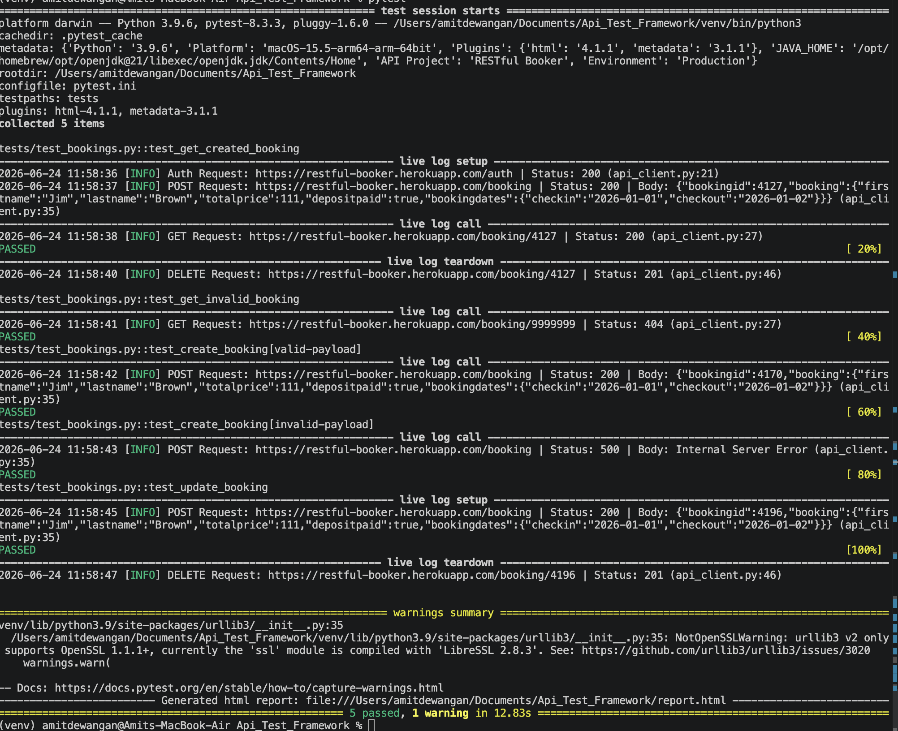

# RESTful Booker API Automation Framework

A production-ready, scalable API testing framework built with Python, Pytest, and the Service Object Model (SOM) pattern.

## 🚀 Key Features
* **CRUD Lifecycle:** Full automated management of Booking resources (Create, Read, Update, Delete).
* **Contract-Driven:** Uses JSON Schema to enforce strict API response structures.
* **Service Object Model (SOM):** Decouples API logic from test scripts for high maintainability.
* **CI/CD Ready:** Integrated with GitHub Actions for automated testing on every push.


## Prerequisites
* Python 3.9+
* pip

## Installation
1. **Clone the repository:**
   ```bash
   git clone <your-repository-url>
   cd Api_Test_Framework

## Setup Virtual Environment:

python -m venv venv
source venv/bin/activate  # Windows: venv\Scripts\activate

## Install dependencies:

pip install -r requirements.txt

## Environment Configuration:
Create a .env file in the root directory based on the template:

BASE_URL=https://restful-booker.herokuapp.com
USERNAME=admin
PASSWORD=password123

## How to Run Tests
Execute the suite and generate the HTML report:

pytest --html=report.html --self-contained-html

## 📂 Project Structure

```text
api_test_framework/
├── .github/workflows/      # CI/CD Pipeline
├── .env                    # Credentials & Configuration
├── conftest.py             # Fixtures & Pytest hooks
├── pytest.ini              # Pytest configuration
├── requirements.txt        # Dependencies
├── src/
│   ├── api_client.py       # Service Object Model
│   └── schemas/            # JSON Schema definitions
└── tests/
    └── test_bookings.py    # Test cases
```

## Directory Structure
- `src/`: Core service objects.
- `tests/`: Pytest test suites.

## Test Coverage
| Test ID | Scenario | Input Data | Expected Status | Validation Strategy |
| :--- | :--- | :--- | :--- | :--- |
| TC01 | Fetch Existing | ID: 1 | 200 | Schema, Latency |
| TC02 | Fetch Missing | ID: 99999 | 404 | Status Code |
| TC03 | Create Valid | Full Payload | 200 | Body Content |
| TC04 | Create Invalid | Incomplete | 500 | Status Code |
| TC05 | Update Booking | Full Payload | 200 | Status Code & Body Content|

## Validation Techniques
1. **Contract Testing:** Used JSON Schema to ensure API changes don't break downstream dependencies.
2. **Performance:** Response time checks ensure the API meets SLA.
3. **Authentication:** The `BookerClient` manages token lifecycle via cookies, ensuring secure access to CRUD operations.
4. **Architectural Why:** The Service Object Model isolates API URL/Auth logic, allowing tests to remain purely descriptive of business requirements.

## 🛡 Validation Strategy: What & Why

Our framework utilizes a multi-layered validation approach to ensure high reliability and data integrity.

| Validation Type | Implementation | Why it is critical |
| :--- | :--- | :--- |
| **Status Code** | `assert response.status_code == 200` | Confirms the endpoint is reachable, business logic passed, and authentication was successful. |
| **Contract (Schema)** | `jsonschema.validate(...)` | Enforces that the JSON structure (types, required fields) never changes, catching "breaking changes" instantly. |
| **Performance** | `response.elapsed.total_seconds() < 2.0` | Ensures the API meets SLA latency requirements and alerts us if the service becomes sluggish. |
| **State Consistency** | `yield` fixture cleanup | Ensures test idempotency; prevents "data pollution" by removing test resources after completion. |

## Test Execution 
Here is the local execution of the test suite :




